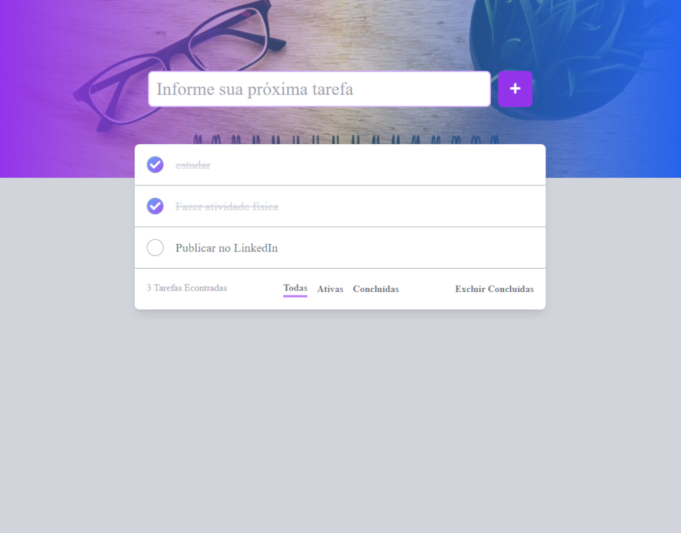

# TodoList_NextJS
# Um simples projeto Front-end de ToDoList usando Next.JS e o framework Tailwind CSS

### Tecnologias usadas:

 
  
  

### Siga os passos abaixo para executar o projeto:
- npm i
- npm run build
- npm start
